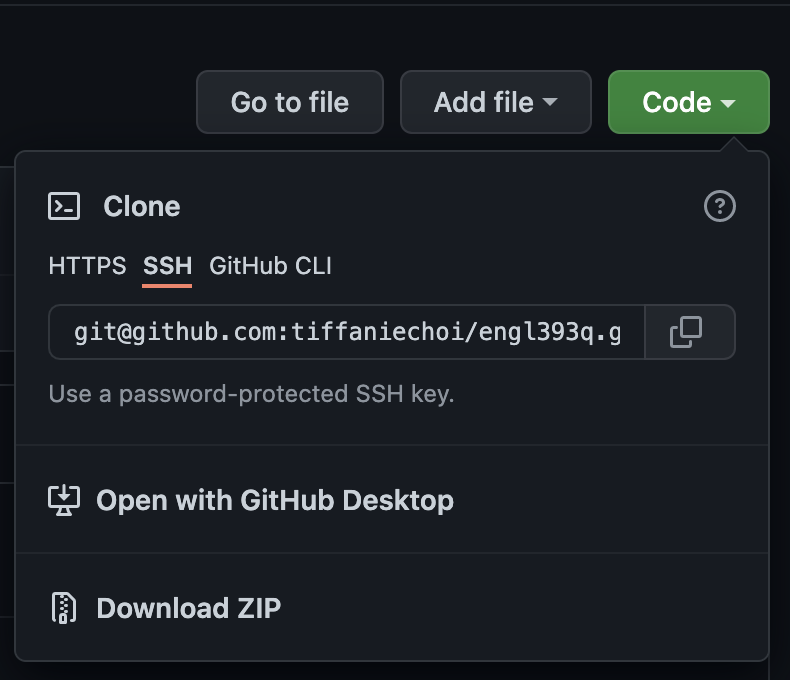

# Introduction
The purpose of GitHub is to organize and store your code. GitHub is widely used for collaborative work in the software development industry.

The features we will go over today are
* Creating SSH Keys
* Cloning any public repository into your local machine
* Creating branches off of any cloned repository
* Saving branch changes
* Creating a GitHub pull request

# Setup
To get git setup on your local environment, follow the steps below.

## SSH Key
> ** Note:** If you do not have a SSH key stored in your local machine, you must generate a new one to use for remote authentication.

### Generating a new SSH key
1. Open your local terminal
1. Enter this command, `ssh-keygen -t ed25519 -C "your_email@example.com`, substituting in your GitHub email address. This will create a new SSH key.
1. When this prompt appears, `> Enter a file in which to save the key (/Users/you/.ssh/id_algorithm): [Press enter]` press Enter. This will accept the default file location. 
1. Next this prompt will appear, `> Enter passphrase (empty for no passphrase): [Type a passphrase]`, where you should enter a secure passphrase.

After you have followed all the steps above, your SSH keyw will be successfully generated.

## How to get started
The steps below will only work once your ssh key is created.

### Clone repository 
1. Go to your git repository site
1. Under code, click the code button and copy the ssh link provided

3. In your local terminal, go to your desired directory
4. Enter this command `git clone <ssh link>` with the ssh link being the one you copied in step 2

Great! Now the repository is cloned onto your local machine!

## Features
This goes over how to work on software development locally, and merging your local work to the remote master branch. 

### Create a branch
In your cloned repository, enter these commands:
1. `git branch <enter branch name here>`
1. `git checkout <branch name>`

### Saving the changes
Now you have switched over to your own branch!
Once you have made the desired changes, enter these commands below to push your branch to your GitHub repository.

1. `git add .`
1. `git commit`
1. `git push --set-upstream origin <branch name>`

### Merging a sub-branch into the master branch
You can now view the branch on online to create a pull request. The purpose of creating a pull request is to review the changes made before commiting it to your master branch.

To get started on your pull request, follow the steps below.

1. Click the `Compare & pull request` button at the top of your GitHub page. 

1. Add a description of the changes you made, and click the `Create pull request` button at the bottom of your GitHub page.

Once a code owner reviews your work, your branch will be merged to master!
